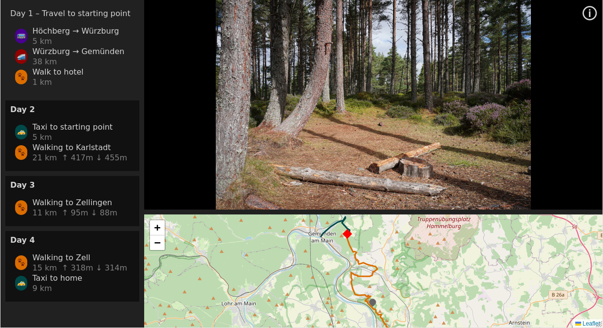

#Imaginary Geo Itinerary

_Imaginary Geo Itinerary_ (IGI) is an image slideshow web application designed for 
presenting pictures from a road trip, such as hiking tours, bicycle journeys, etc:

The left side pane shows the itinerary. It can be split in different groups. For example, 
in the image above the whole hiking tour was split into its four days. Each of the group
can again have multiple tracks. The screenshot shows that the second day consisted of a
taxi trip and the actual hiking trip. Every group can be either selected or unselected. Here,
Day 2, Day 3, and Day 4 are selected.

All tracks of all selected groups are shown in the map in the lower part of the screen. All image locations are shown, too.

The upper part of the app consists of the image slideshow. It slides through the pictures belonging
to the currently selected groups. The location of the current image is emphasized in the map.

IGI offers the possibility to either show the map only, the images only, or the combined view (see Presenting below).

## Using IGI
### Prerequisites

You need the following prerequisites for using IGI:

* any web server, e.g. Apache, nginx, …
* a text editor and basic knowledge of JSON
* your tracks in form of GPX files
* pictures from your journey, together with their coordinates (unfortunately, it doesn't suffice to 
  have the coordinates stored inside the images, see Limitations below.)
* the IGI binaries (e.g. downloaded from Github's release page) __or__
* npm installed to build the app from scratch: `npm i && npm run build`. The binaries are then stored in the `dist` directory.

### Creating an itinerary

1. Move IGI's binaries into your web server.
2. Create a directory `itinerary` in the same directory where IGI is.
3. Move your images and GPX files into `itinerary`. You can use any subdirectory structure you like.
4. Replace the `favicon.png` by an appropriate image of your own. The favicon is not only shown
   in the browser's toolbar, but also in the general image area if the current group selection does not contain
   an image.
5. Download the sample `itenerary/index.json` file from this repository and adapt it to your needs. Most of the
   format is self-explanatory. Information on the non-self-explanatory parts:
   
   * The `map` property defines the center of the map if the initial selection of the group does not have any images.
   * The `info` property allows you to specify a link in the app info menu, which appears after pressing the (i)-button.
     This can be used to link to a legally required contact information if you plan to make the itinerary available to the public.
   * The `types` property defines the means of transport you used during the trip. Each type has a color and an optional
     symbol. These are used in the itinerary list and the map.
   * The coordinates in the image objects are `[lat, lng]`. We're using an array here because there could be a lot of
     images and this saves a few bytes compared to the object notation.
6. Navigate to your server's URL and enjoy your itinerary.

